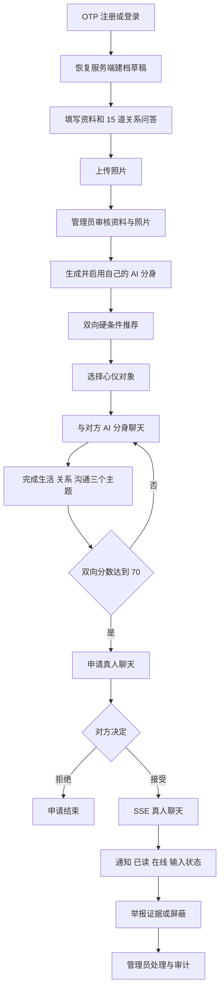

# 缘来相伴 AI 婚恋平台项目状态

> 更新时间：2026-08-14
>
> 当前分支：`codex/design-optimization`
>
> 项目目录：`ai-marriage-platform-design`

> 交付范围：仅包含响应式网页、网页管理后台、API、PostgreSQL、MinIO、Docker、测试和文档；不包含 Electron、Tauri 或任何其他桌面客户端。

## 1. 状态总览

| 领域 | 当前状态 | 说明 |
| --- | --- | --- |
| 门户与中年用户界面 | 已实现 | 首页、大厅、详情、消息、内容、个人中心和响应式布局 |
| OTP 注册登录 | 本地闭环完成 | 固定开发 OTP、30 天会话、设备管理和单进程基础限流；真实短信审批不在范围内 |
| 建档与照片 | 已实现 | 服务端草稿、15 道问答、照片上传、可见范围和审核闭环 |
| AI 分身 | 已实现 | 摘要、知识治理、版本、启用/暂停/撤销；推荐前要求自己先启用 |
| 匹配 | 已实现规则版 | 双向硬条件、服务端筛选、稳定游标分页、跳过、保存方案、评分因素和算法快照 |
| 心仪门槛 | 已实现 | 正式会员创建 AI 会话和申请真人聊天时均检查心仪状态 |
| AI 分身聊天 | 已实现 | 历史、三个主题、统一适合度分析和 10 分钟 20 条限流 |
| 真人聊天 | 已实现 | 7 天申请、唯一会话、SSE、新消息、在线、输入状态、已读回执、限流和资金风险拦截 |
| 通知与安全 | 已实现 | 全局未读、举报证据、屏蔽/解除及关键入口阻断 |
| 账号生命周期 | 已实现 | 主动暂停、管理员停用/恢复、申诉、7 天注销和数据导出 |
| 内容与活动 | 已实现 | 会员动态文字与最多 9 张独立动态图片、本人状态查看/删除、公开多图展示、点赞、活动报名，以及后台编辑/发布/下线/删除 |
| 管理后台 | 已实现本地闭环 | 审核、账号、申诉、举报、内容、审计和维护 |
| PostgreSQL/MinIO | 已实现 | 8 个迁移、私有对象存储和跨 API 重启持久化脚本 |
| 单机部署与维护 | 已提供 | 完整 Demo Compose、迁移、PostgreSQL 与 MinIO 联合备份恢复、SHA-256 恢复集校验和手动清理任务 |
| 生产级运营 | 明确未完成 | 不含实名、短信审批、备案、分布式风控、高可用和大规模运营 |

## 2. 完整业务流程



账号安全流程独立覆盖设备会话、主动暂停、管理员停用申诉、数据导出和注销冷静期。

## 3. 关键规则落地情况

### AI 分身前置

- `GET /api/recommendations` 要求当前用户已启用自己的 AI 分身。
- 正式候选人只有账号、资料、照片、可见性和 AI 分身全部符合要求时才进入会员投影。
- 暂停、撤销或资料重提都会使会员下架；资料重审不自动重启 AI 分身。

### 心仪门槛

- 正式会员调用 `POST /api/avatar-sessions` 前必须存在活动心仪记录。
- `POST /api/chat-requests` 再次检查该心仪记录。
- 取消心仪后不能借已有 AI 会话绕过真人联系门槛。

### 双向算法

- 当前版本：`bidirectional-rules-v1.0.0`。
- 双向硬条件：性别、年龄、地点/异地、婚姻状态、关系目标。
- 评分因素：年龄期待、生活地点、关系目标、经历契合、看重品质和资料可信度。
- 推荐和 AI 阶段分析使用相同算法，返回并保存 `score`、`reasons`、`factors`、`algorithmVersion`。
- 真人聊天门槛为三个主题完成且得分至少 `70`。

### 服务端筛选与分页

- `GET /api/members` 和 `GET /api/recommendations` 均在服务端完成筛选、排序和分页。
- 公开大厅支持性别、年龄、城市、婚姻状态、关系目标、吸烟、子女、仅看有照片和多种排序方式。
- 推荐接口支持性别、年龄、城市、婚姻状态、关系目标和匹配分排序。
- 响应统一包含 `total`、`pageSize`、`nextCursor` 和 `hasMore`，并使用稳定游标继续加载。
- v3 游标携带 30 分钟冻结结果集并使用应用加密密钥压缩签名；排序字段变化、新增或删除会员不会造成重复或遗漏，密钥不变时可跨 API 重启继续，跨筛选或跨排序复用会返回 `400 INVALID_CURSOR`。
- 非法筛选返回 `400 INVALID_MEMBER_SEARCH` 或对应筛选错误；无效、失效游标返回 `400 INVALID_CURSOR`。
- `/find` 已接入真实分页 API，不再先下载完整列表后仅在浏览器内筛选。
- `/matchmaking` 保存 `nextCursor`、`hasMore` 和总数，支持加载更多并按会员 ID 去重。

### 可见性和屏蔽

- 游客大厅只展示 `public` 正式资料和演示会员。
- `approved_only` 可进入双向推荐，但不会出现在游客公开大厅。
- 任一方向屏蔽都阻止展示、心仪、AI 会话、分析、申请、接受和真人消息。

## 4. 账号和安全

- OTP：手机号 60 秒冷却、IP 10 分钟最多 20 次、单码最多错误 5 次。
- AI 提问：每用户 10 分钟最多 20 条，返回 `429 AVATAR_MESSAGE_RATE_LIMITED`。
- 管理员停用带 `admin` 来源；OTP 登录不会自动恢复，只允许进入账号安全页申诉。
- 用户主动暂停带 `self` 来源；再次 OTP 登录可恢复。
- 注销有 7 天冷静期；到期由 OTP 登录懒执行或管理员维护任务执行。
- 到期注销将账号标记 `deleted`、撤销会话并下架会员，不声称立即物理擦除所有历史记录。
- 数据导出 JSON 在 24 小时内可下载，覆盖账号、资料、照片元数据、匹配、AI 知识与聊天、真人聊天、通知、举报、屏蔽、申诉、点赞和报名。

举报证据支持 AI 会话、真人会话和具体消息。服务端校验会话参与者、目标用户、消息所属关系以及真人消息发送者，不能引用无关消息作为证据。

## 5. 实时通信

当前真人聊天不再是纯轮询版本：

- `GET /api/realtime/events` 提供 SSE 长连接。
- 事件包含新消息、通知、已读、在线和输入状态。
- 支持 `Last-Event-ID` 格式校验和进程内事件重放窗口。
- 输入状态 5 秒自动失效。
- 消息和回执持久化；在线、输入状态和 SSE 事件历史属于单 API 进程，不是跨实例总线。
- 真人申请 7 天未处理自动过期；过期申请不能接受或拒绝，满足当前门槛后可重新发起。
- 真人消息要求客户端幂等标识，每用户每分钟最多 30 条；API 拦截转账、银行卡、保证金等资金风险文本。

尚未提供 WebSocket、Redis Pub/Sub、跨实例实时广播、离线 Web Push 或多媒体消息。

## 6. 后台与维护

网页后台已实现角色分权：`moderator` 仅可查看和处理资料、照片、举报；以下其余能力只向 `admin` 开放。

管理员端已实现：

- 资料和照片审核。
- 用户列表、停用和恢复。
- 用户申诉处理。
- 举报及证据处理。
- 会员提交待审核生活动态，可带最多 9 张图片，并可查看审核状态或删除自己的动态。
- 内容草稿、编辑、发布、下线和删除；公开内容支持多图展示。
- 管理员审计日志。
- 运维摘要和过期资源清理。

`POST /api/admin/operations/cleanup` 清理：

1. 到期账号注销。
2. 过期 OTP。
3. 过期登录会话。
4. 过期数据导出正文。

每次运行和每个步骤结果都会保存。仓库未提供内置定时器，生产或长期测试环境需用计划任务、外部调度或人工操作触发。

### 数据一致性修复

- 取消心仪后，旧 AI 会话不能继续用于接受真人聊天申请；选择自己为心仪对象会被拒绝。
- 内容与 AI 知识变更采用串行写入，并在持久化失败时回滚内存状态。
- 资料、建档草稿、照片和 AI 状态写入失败时不会提前污染运行时状态。
- 真人消息、消息回执和通知使用同一持久化事务写入。
- 注销清理内容活动归属和 AI 知识归属数据，避免遗留用户关联。
- 会员动态图片使用独立 `moments/` 对象命名空间，不占资料相册 6 张额度，也不会进入照片审核；上传期间不可发布并先持久化预留对象键，失败清理中断时保留不可公开的可重试索引。
- 本人删除、管理员删除和到期注销采用“持久化下线、删除对象、移除记录”的两阶段流程；公开读取只允许已发布动态引用的对象，其他状态仅作者和后台可读且统一禁止共享缓存。

## 7. 数据与迁移

### 数据位置

| 数据 | 位置 |
| --- | --- |
| 登录 Cookie | 浏览器 HttpOnly Cookie |
| 非敏感页面草稿 | 浏览器 Local/Session Storage，服务端草稿为准 |
| 账号、资料、匹配、聊天、安全、内容、运维记录 | PostgreSQL；无 `DATABASE_URL` 时仅内存 |
| 资料照片与动态图片对象 | Data URL Provider 或私有 S3/MinIO；分别使用 `photos/` 与 `moments/` 命名空间 |
| 资料照片归属、Key 和审核状态 | PostgreSQL 照片表 |
| 动态图片引用 | PostgreSQL 内容多图字段保存站内受控读取 URL，URL 可恢复对应对象 Key |
| 在线、输入、限流和 SSE 事件窗口 | 当前 API 进程内存 |

### 当前迁移

```text
20260813000100_initial_schema
20260814030000_message_sender_idempotency
20260814031000_platform_capabilities
20260814040000_persistent_domain_state
20260814050000_complete_local_workflow
20260814170000_avatar_reply_failure_recovery
20260814190000_avatar_conversation_rounds
20260814210000_member_moment_images
```

`20260814170000_avatar_reply_failure_recovery` 增加 AI 问题幂等键和可持久恢复的 AI 回复失败任务；`20260814190000_avatar_conversation_rounds` 移除 AI 会话的用户/对象唯一约束，允许结束后开启新一轮了解并保留历史；`20260814210000_member_moment_images` 增加内容多图字段，持久化会员动态图片。

## 8. Provider 和演示边界

| 能力 | 本地默认 | 可接入 | 不代表 |
| --- | --- | --- | --- |
| 短信 | Console/固定开发 OTP | HTTP Webhook | 已获得短信签名、模板或供应商审批 |
| 照片 | Data URL 或本地 MinIO | 私有 S3-compatible | 已配置生产 CDN 和媒体审核 |
| AI | Deterministic | OpenAI-compatible | 已完成真实模型评估和合规审批 |
| 数据库 | PostgreSQL 或内存 | 单机 Compose PostgreSQL | 已提供高可用数据库 |

内存模式的预置人物和部分种子内容是演示数据。注册用户、AI 会话和真人聊天可以是真实业务状态，但能否持久化取决于 PostgreSQL/S3 配置。

## 9. 明确排除

以下内容不是待修复缺陷，而是本项目本轮明确排除：

- 实名认证、身份证、活体检测、人脸认证。
- 真实短信签名、模板报备和供应商账号审批。
- 正式备案与面向生产运营的完整隐私/合规流程。
- 生产级分布式风控、WAF、高可用、多地域、自动扩缩容和海量并发。
- 内容状态与管理员审计等多步骤写入的生产级原子事务、补偿和自动对账；当前顺序写入在审计失败时可能出现内容已生效但接口返回失败。
- 可直接大规模商业运营的组织、监控、客服和灾备体系。

## 10. 仍可继续增强

- 分布式 OTP/AI 限流、设备维度和每日额度。
- 图片压缩、EXIF 清理、预签名直传、内容安全审核和 CDN。
- 算法离线评估、参数治理、A/B 测试和真实效果验证。
- 跨实例实时事件总线、Web Push、多媒体消息和会话归档。
- 自动调度维护、全链路可观测性、备份告警和密钥重加密工具。

## 11. 完成度判断

| 目标 | 判断 |
| --- | --- |
| 完整本地用户流程 | 已完成 |
| 前后台与账号维护 | 已完成本地闭环 |
| PostgreSQL/MinIO 跨重启 | 已实现并有冒烟脚本 |
| 完整 Demo Compose 与备份恢复 | 已实现并通过基础设施契约测试 |
| 真实短信与真实模型 | 代码可接入，外部审批和凭据未提供 |
| 实名与生产备案 | 明确排除 |
| 生产级风控、高可用和大规模运营 | 明确未实现 |

当前最准确的表述：

> **要求范围内的完整本地 AI 婚恋联系 Demo 已落地；外部 Provider 开通和生产级运营能力不在本轮完成范围内。**

## 12. 2026-08-14 最新验证记录

本轮重新执行 `npm.cmd run verify`，结果：

- API：48 个测试文件，`435/435` 通过。
- Web：24 个测试文件，`301/301` 通过。
- 基础设施契约：`36/36` 通过。
- Shared、Web、API 构建通过。
- Prisma Schema 校验通过。
- Vite 构建仅有约 `582 kB` chunk 拆包提示，不影响构建成功。

真实集成与网页验收：

- `npm.cmd run verify:integration` 已通过：8 个迁移成功部署，资料照片、会员动态图片、AI 分身、双向会话复用、真人消息、屏蔽/解除和资料重提状态均在 API 重启后恢复；动态删除后再次重启不会复活。
- 本地集成命令已补齐 `prisma migrate deploy`，避免旧数据库漏迁移时在 API 启动阶段失败。
- 浏览器已实际完成验证码注册登录、六步建档入口、会员详情、心仪前置流程、审核员登录和管理后台内容入口验收。
- 桌面 `1440 × 900` 与手机 `390 × 844` 已检查首页、匹配大厅、建档、动态发布和管理后台：无横向溢出、无破图、无控制台错误，手机主菜单可正常展开。
- 浏览器验收发现并修复了“内存手机号索引未命中时重复创建数据库用户”的登录问题，新增回归测试保证先恢复已有用户再创建会话。

完整 Demo Compose 已在隔离端口两次尝试实际构建；两次均在 Docker Hub 获取 Node/Nginx 基础镜像令牌时发生外网连接超时，尚未进入容器应用健康检查，因此备份和隔离恢复演练未在本机完成。Compose、迁移、健康检查、长游标网关配置、备份恢复和 SHA-256 校验已通过 `36/36` 基础设施契约测试，真实 PostgreSQL/MinIO 持久化已由独立集成命令验证。

交付目标始终是响应式网页系统及其网页管理后台和服务端基础设施，不包含桌面客户端。
