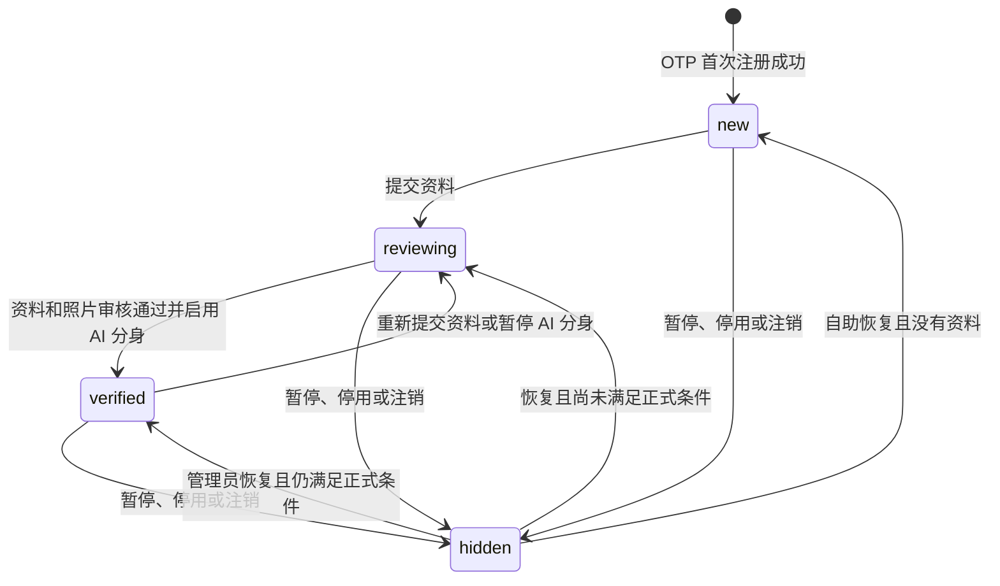

# 注册即进入寻找缘分大厅设计

> 日期：2026-08-14  
> 状态：已确认设计，等待实现  
> 适用页面：`/find`

## 1. 目标

用户通过 OTP 首次注册成功后，无需等待资料填写或管理员审核，即可在“寻找缘分”大厅中生成一张安全的“新加入会员”占位卡。

该能力只增加大厅中的加入感和活跃感，不改变正式婚恋联系流程。资料审核、照片审核、AI 分身启用、心仪、AI 聊天和真人聊天的现有准入规则继续有效。

## 2. 核心原则

1. 注册即展示，但不公开手机号、原始用户 ID 或未审核敏感资料。
2. 不使用虚构的年龄、性别、城市、婚姻状态或照片填充未知字段。
3. 占位会员只存在于公开大厅，不进入正式推荐候选集。
4. 占位会员不能被心仪、跳过、发起 AI 会话或申请真人聊天。
5. 登录用户不能在大厅中看到自己的占位卡或完整会员卡。
6. 账号暂停、管理员停用、注销完成后立即从大厅移除。
7. 已有正式会员的审核和联系规则不得因本功能放宽。

## 3. 会员展示状态

### 3.1 `new`

适用于已注册但尚未提交完整资料的普通活跃账号。

公开字段：

- 稳定的大厅会员标识，不返回原始数据库用户 ID。
- 昵称固定为“新加入会员”。
- 默认头像资源。
- 状态文案“资料待完善”。
- 活跃文案根据真实登录活动生成，例如“刚刚加入”或“近期加入”。
- 注册时间，用于“最新加入”排序。

不返回手机号、年龄、性别、城市、职业、婚姻状态、交往目标、问答、偏好或介绍。

### 3.2 `reviewing`

适用于已经提交资料但尚未达到正式会员条件的普通活跃账号，包括资料待审核、照片待审核、AI 分身尚未启用等状态。

公开字段：

- 审核中的昵称和已填写基础信息可以用于卡片摘要。
- 未审核照片不得公开，继续使用默认头像。
- 未审核个人介绍和关系问答不得公开。
- 状态文案为“资料审核中”或能够准确说明当前进度的等价文案。

该状态仍然不能进入推荐或联系流程。

### 3.3 `verified`

适用于现有正式会员条件全部满足的账号：账号活跃、资料审核通过、至少一张照片审核通过、可见性允许、AI 分身已启用。

继续使用现有完整会员投影和联系流程，不改变字段、筛选、推荐、心仪或聊天行为。

## 4. 服务端设计

### 4.1 数据来源

占位卡不新增独立数据库表，也不伪造完整 `StoredMember`。`GET /api/members` 在读取时合并两类数据：

1. 现有完整会员投影。
2. 活跃普通账号中尚未形成完整会员投影的账号，转换为受限大厅投影。

PostgreSQL 中的 `User`、`Profile` 和现有会员投影仍是权威数据来源。API 重启后可以从持久化账号重新生成占位结果，不依赖进程内临时记录。

### 4.2 公共契约

公共 `Member` 增加明确状态字段：

```text
lobbyStatus = new | reviewing | verified
```

人口属性字段对 `new` 状态允许缺失。前端必须根据 `lobbyStatus` 渲染，不得给缺失字段提供虚构值。

### 4.3 列表与筛选

- 默认大厅同时返回占位会员和完整会员。
- “最新加入”排序按真实账号创建时间排序。
- `new` 状态不参与年龄、性别、城市、婚姻、目标、吸烟、子女和仅看有照片等条件筛选。
- 用户主动应用任一依赖资料的筛选条件后，只返回能够真实匹配该条件的 `reviewing` 或 `verified` 会员。
- 默认年龄范围不视为用户主动筛选，不得使新注册占位卡从默认大厅消失。
- 分页游标继续使用稳定签名结果集，账号状态变化后新请求反映最新可见性，已开始的分页保持无重复和无遗漏语义。

### 4.4 详情与操作

- 占位卡不链接到正式会员详情页。
- 服务端针对占位会员的心仪、跳过、AI 会话和聊天申请统一拒绝，使用明确业务错误码 `MEMBER_PROFILE_INCOMPLETE`。
- 推荐接口只读取 `verified` 完整会员投影，不读取大厅占位投影。
- 屏蔽关系仍从大厅双向隐藏相关账号。

### 4.5 隐私和角色

- 只为 `role=user` 且 `status=active` 的账号创建占位投影。
- 管理员和审核员不进入大厅。
- 当前登录账号从自己的大厅响应中排除。
- 游客可以看到受限占位卡，但不能获得可反查手机号的字段。

## 5. 前端设计

### 5.1 占位卡

占位卡沿用现有会员卡尺寸，避免网格布局跳动，但使用独立状态样式：

- 默认头像。
- “新加入”状态标记。
- 标题“新加入会员”。
- 说明“资料待完善”。
- 主按钮显示“资料完善中”并禁用。
- 不显示年龄、城市、职业、婚姻状态、交往目标和兴趣标签。
- 不显示心仪按钮。

### 5.2 审核中卡片

- 展示允许公开的基础摘要。
- 使用默认头像，不显示未审核照片。
- 显示“资料审核中”。
- 不显示心仪按钮，主按钮不可进入正式联系流程。

### 5.3 大厅文案

删除“仅展示审核通过的资料”的绝对表述，改为：

> 新加入会员会先以安全占位卡展示，完成审核后开放完整资料与联系功能。

筛选结果数、分页和空状态继续以 API 返回为准。

## 6. 状态转换



## 7. 错误处理

- 大厅占位投影生成失败时，不影响注册成功响应；错误写入服务端日志，下一次大厅读取重新生成。
- 占位会员在用户点击期间完成资料升级时，客户端刷新后展示最新状态。
- 占位会员在分页期间被停用或注销时，后续公开读取不得再次返回；已有签名分页可以跳过已不可见项。
- 客户端收到 `MEMBER_PROFILE_INCOMPLETE` 时显示“对方正在完善资料，暂时不能联系”，不得跳转到自己的建档流程。

## 8. 测试与验收

### API

1. OTP 首次注册后，游客调用 `GET /api/members` 能看到一张 `lobbyStatus=new` 的占位卡。
2. 响应不包含手机号、原始用户 ID、虚构人口属性或未审核资料。
3. 注册用户登录后调用大厅接口看不到自己。
4. 管理员和审核员注册或登录后不会进入大厅。
5. 提交资料后占位状态变为 `reviewing`，未审核照片仍不公开。
6. 满足正式会员条件后状态变为 `verified`，且只保留一张对应会员卡。
7. 暂停、管理员停用和注销后立即从大厅消失，恢复后按真实状态重建。
8. 占位会员不进入推荐接口。
9. 对占位会员执行心仪、跳过、AI 会话和聊天申请均返回 `MEMBER_PROFILE_INCOMPLETE`。
10. API 重启后，占位会员仍可从 PostgreSQL 账号恢复。

### Web

1. 占位卡不渲染虚构年龄、城市或照片。
2. 占位卡没有心仪按钮，主按钮不可点击。
3. 审核中状态显示准确提示。
4. 正式会员卡保持原有视觉和操作行为。
5. 大厅文案准确描述占位与审核规则。
6. 桌面和移动端网格不因状态切换产生溢出或明显位移。

### 回归

- 原有公开筛选、稳定分页、屏蔽、推荐、心仪、AI 聊天和真人聊天测试继续通过。
- `npm.cmd run verify` 必须通过。
- PostgreSQL 持久化集成测试增加注册占位跨 API 重启恢复断言。

## 9. 明确不做

- 不公开手机号或通过占位卡推断手机号。
- 不为未知字段生成假年龄、假城市、假职业或假照片。
- 不允许占位会员进入匹配算法。
- 不放宽照片、资料、AI 分身和真人聊天门槛。
- 不在本功能中接入真实短信、实名认证或生产级内容风控。

